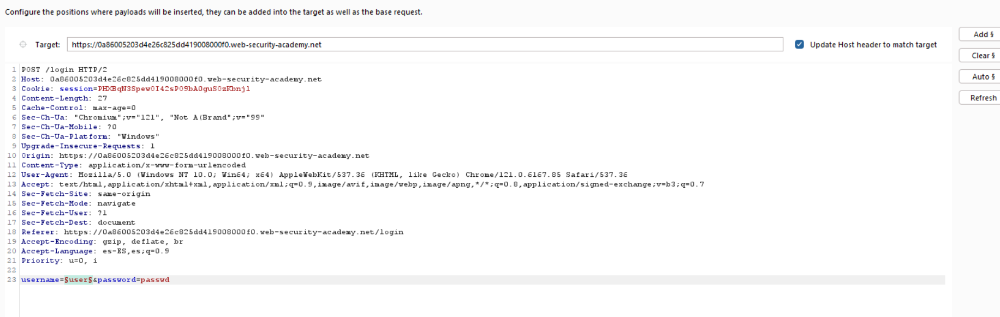
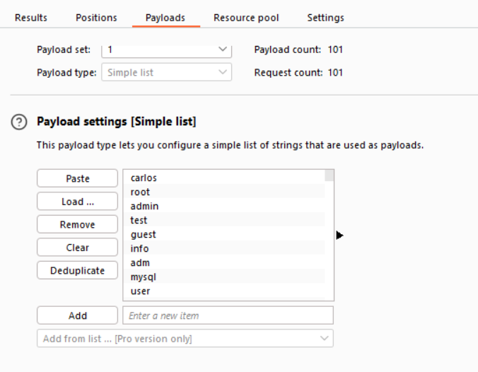
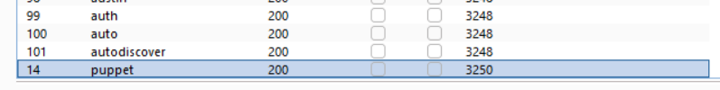
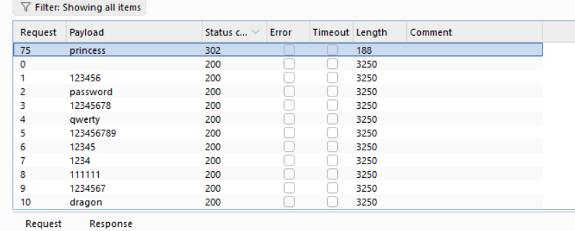
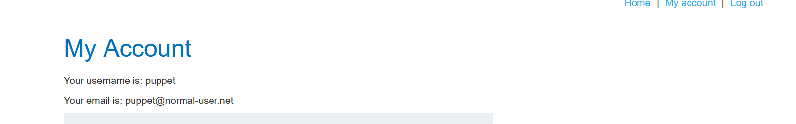
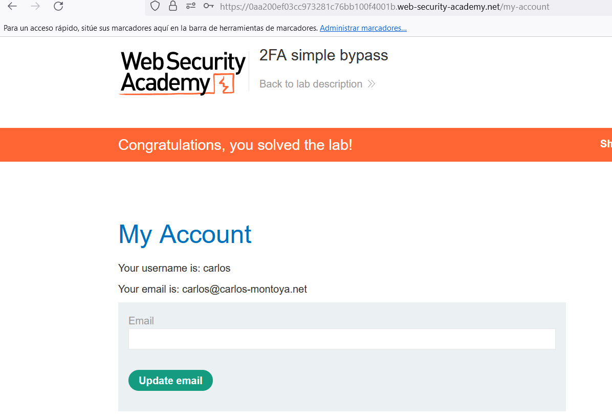

## Brute-force attacks
Brute-force is when an attacker tries to guess the username or password of a user through automatic tools using wordlists. The systems must have more than one method of authentication to prevent this attack.

When a user creates a user account could write a password that does not comply with password policies but the user changes lightly the password, however, the password can be predictable.

A good practice to avoid brute-force attacks is to make HTTP responses return the same no matter if the username is valid or not because the attackers can analyze the behavior of the response to identify valid users. Even a single character in two responses can make a difference in recognizing a user. Furthermore, the time responses must be equal if a user is valid or not because the attacker can write a long password and realize that time of responses differ.

- **Lab: Username enumeration via different responses**:  This lab is vulnerable to username enumeration and password brute-force attacks. It has an account with a predictable username and password, which can be found in the following wordlists.
To solve the lab, enumerate a valid username, brute-force this user's password, then access their account page. 

## Bypassing two-factor authentication
Sometimes 2FA can be bypassing if the code verification page is separtly of the login page, and the attacker before enter the password skip these code verification page.

- **Lab: 2FA simple bypass**: 
   This lab's two-factor authentication can be bypassed. You have already obtained a valid username and password, but do not have access to the user's 2FA verification code. To solve the lab, access Carlos's account page.

    Your credentials: wiener:peter
    Victim's credentials carlos:montoya

Enter with Carlos credentials and doing path traversal using /my-account URL allows enter to user account without 2FA.