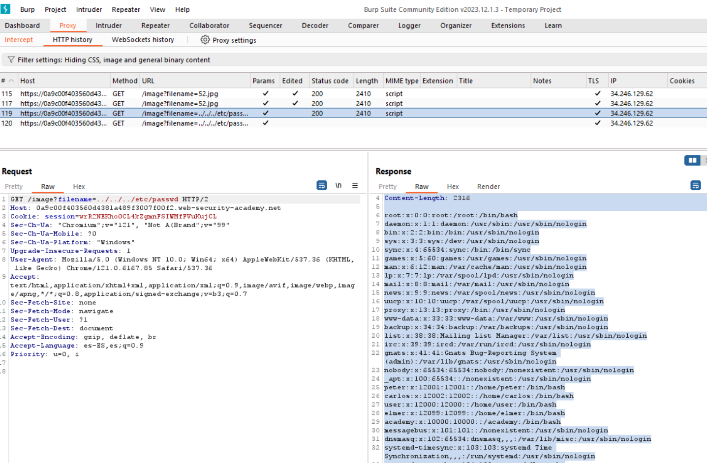
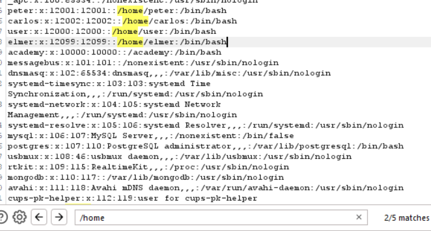
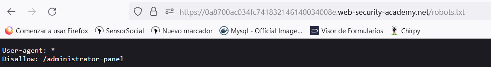
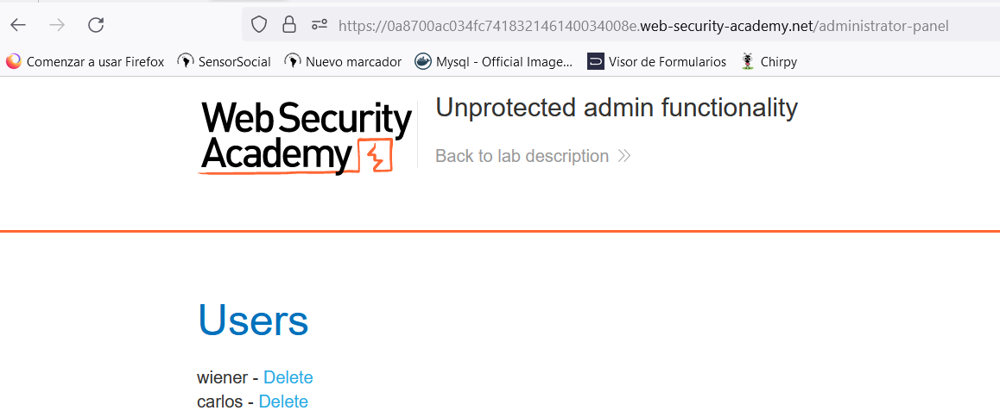
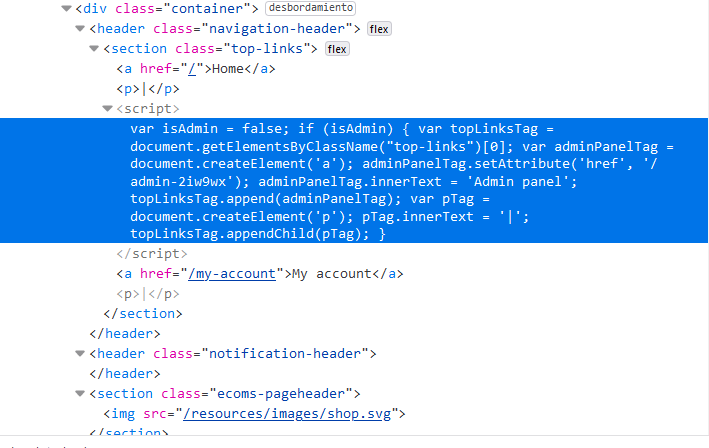
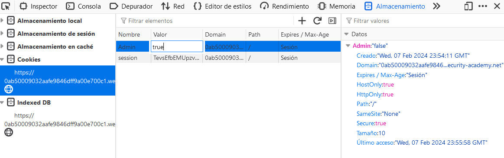
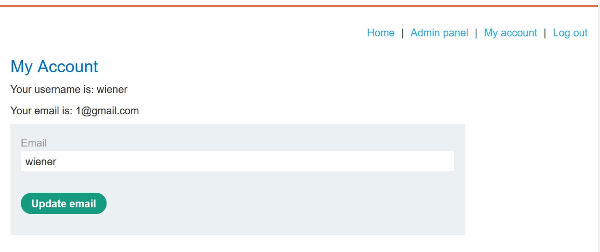
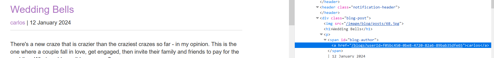
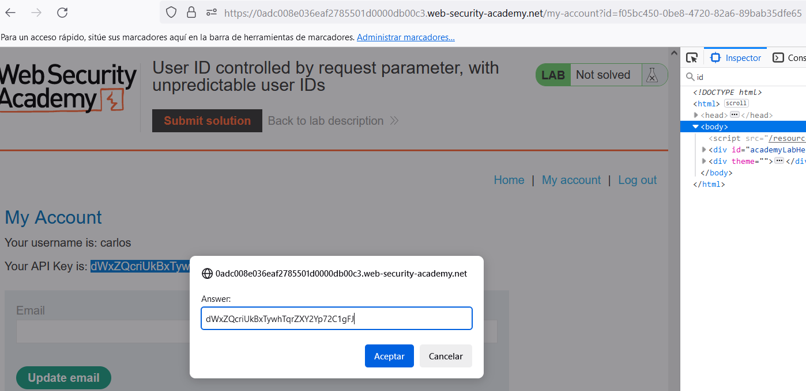
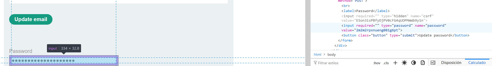

## Path traversal 
Path traversal is a vulnerability in which the attacker uses URL path parameters commonly used for backend services and API's in web pages. With these parameters, the attacker can manipulate the request to grab other files.

- **Lab: File path traversal, simple case**:  This lab contains a path traversal vulnerability in the display of product images. To solve the lab, retrieve the contents of the /etc/passwd file. 

  
  
  In this file, the user accounts on the system are shown, each with its user name, user ID, group ID, description, home directory, and shell. The lines are in the standard format of the /etc/passwd file on Unix/Linux systems.
  

## Vertical Escalation
When a user does actions and gains access to restricted resources of one user that are at the same level. 
A typical example of this escalation is when a user can enter admin files through open admin urls, APIs and services.

- **Lab: Unprotected admin functionality**: This lab has an unprotected admin panel.
Solve the lab by deleting the user carlos. 

- **Lab: Unprotected admin functionality with unpredictable URL**:  This lab has an unprotected admin panel. It's located at an unpredictable location, but the location is disclosed somewhere in the application.
Solve the lab by accessing the admin panel, and using it to delete the user carlos. 

This script verifies that the user is admin but the URL is open to all users regardless of their role.

## Parameter-based access control methods
Applications can save information about the user's role in changeable storage or parameters. That allows them to user actions of other roles.

- **Lab: User role controlled by request parameter**: This lab has an admin panel at /admin, which identifies administrators using a forgeable cookie. Solve the lab by accessing the admin panel and using it to delete the user carlos. You can log in to your own account using the following credentials: wiener:peter 

## Horizontal Escalation
Happens when a user can access to resources of the user that has the highest privileges.

Insecure Direct Object Reference (IDOR) vulnerability

The GUIDs (Globally Unique Identifier) can protect to guess the user identifier. However, GUID may be present in the application.

- **Lab: User ID controlled by request parameter, with unpredictable user IDs**:  This lab has a horizontal privilege escalation vulnerability on the user account page, but identifies users with GUIDs. 
To solve the lab, find the GUID for carlos, then submit his API key as the solution.
You can log in to your own account using the following credentials: wiener:peter 

## Horizontal to vertical privilege escalation
Once the attacker did horizontal escalation he may do vertical escalation gain access to resources of other users.

- **Lab: User ID controlled by request parameter with password disclosure**:   This lab has user account page that contains the current user's existing password, prefilled in a masked input.
To solve the lab, retrieve the administrator's password, then use it to delete the user carlos.
You can log in to your own account using the following credentials: wiener:peter 
